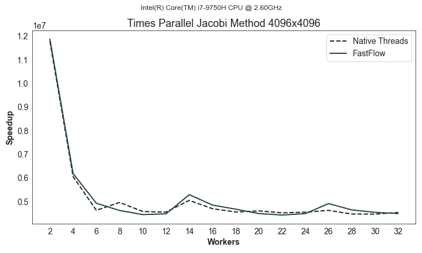
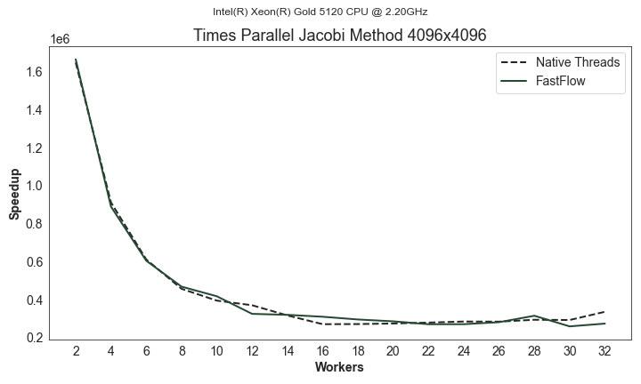

## Parallel Jacobi Method

This repository contains the final project for "**Parallel and Distributed Systems: Paradigms and Models**" (a.y. 2021/2022)
course at University of Pisa.

### Problem Description

The Jacobi iterative method computes the result of a system of equations Ax = B (with x vector of
variable of length n, A matrix of coefficients of dimension n by n and B vector of known terms of length
n) iteratively computing a new approximation of the values of the different variables according to the
formula:

$$
x_i^{(k + 1)} = \frac{1}{a_{ii}}\bigg(b_i - \sum_{j != i}a_{ij} * x_j^k\bigg) \quad i = 1 \dots n
$$

starting from some initial assignment of each xi (e.g. 0).

We require to implement the Jacobi method with both native C++ threads and FastFlow.

### Usage

The program expects four positional arguments:

- **size**: how big the matrix will be.
- **nw**: how many workers will be used in the parallel computation.
- **seed**: pseudo-random generator's seed used to generate diagonally dominant matrices.
- **iterations**: how many iterations the solver will perform.

This is a sample run on my machine:

```shell
./jacobi -o output.csv 4096 8 42 1000
```

It runs the Jacobi solver using a matrix of size 4096 x 4096 doubles with 8 parallel workers.

### Report

The report will contain information about the project's performances (such as the speedup) with some charts.

### Building

To build the project run these commands on a terminal:

```shell
mkdir build
cd build
cmake -DCMAKE_BUILD_TYPE=Release -DBUILD_EXAMPLES:BOOL=OFF -DBUILD_TESTS:BOOL=OFF ..
cmake --build .
```

### Tests

Tests can be run using CTest utility. The `CMakeLists.txt` file define a function
to test Jacobi method on different matrix sizes. There are defined 6 test suites, each suite
use threads from 2 to 32, increasing by two each time.

```cmake
function(NEW_TEST_SUITE MATRIX_SIZE)
    foreach (nw RANGE 2 32 2)
        message(STATUS "Creating new test suite (Matrix Size: ${MATRIX_SIZE}, Workers: ${nw})")
        add_test(Matrix_${MATRIX_SIZE}_${nw} ${PROJECT_NAME} -o output_${MATRIX_SIZE}.csv ${MATRIX_SIZE} ${nw} 42 1000)
    endforeach ()
endfunction()

# Define a new test suite with a matrix 8Kb x 8Kb
new_test_suite(8192)
```

Tests can be run inside the build directory after building the project, invoking `ctest`.

The Jupyter Notebook defined inside `script` folder generate charts used by the report. For instance,
these are the application's time over a matrix of size 4Kb x 4Kb (_lower is better_).





All the plots can be found inside the folder [scripts/images](./scripts/images/).

### Dependencies

The project has three dependencies. Each of them is downloaded using CMake's FetchContent module.

- [argparse](https://github.com/p-ranav/argparse.git)
- [fmt](https://github.com/fmtlib/fmt.git)
- [FastFlow](https://github.com/fastflow/fastflow.git)
- [CMake 3.23](https://cmake.org)

### License

MIT License

Copyright (c) 2022 Gabriele Pappalardo

Permission is hereby granted, free of charge, to any person obtaining a copy
of this software and associated documentation files (the "Software"), to deal
in the Software without restriction, including without limitation the rights
to use, copy, modify, merge, publish, distribute, sublicense, and/or sell
copies of the Software, and to permit persons to whom the Software is
furnished to do so, subject to the following conditions:

The above copyright notice and this permission notice shall be included in all
copies or substantial portions of the Software.

THE SOFTWARE IS PROVIDED "AS IS", WITHOUT WARRANTY OF ANY KIND, EXPRESS OR
IMPLIED, INCLUDING BUT NOT LIMITED TO THE WARRANTIES OF MERCHANTABILITY,
FITNESS FOR A PARTICULAR PURPOSE AND NONINFRINGEMENT. IN NO EVENT SHALL THE
AUTHORS OR COPYRIGHT HOLDERS BE LIABLE FOR ANY CLAIM, DAMAGES OR OTHER
LIABILITY, WHETHER IN AN ACTION OF CONTRACT, TORT OR OTHERWISE, ARISING FROM,
OUT OF OR IN CONNECTION WITH THE SOFTWARE OR THE USE OR OTHER DEALINGS IN THE
SOFTWARE.
